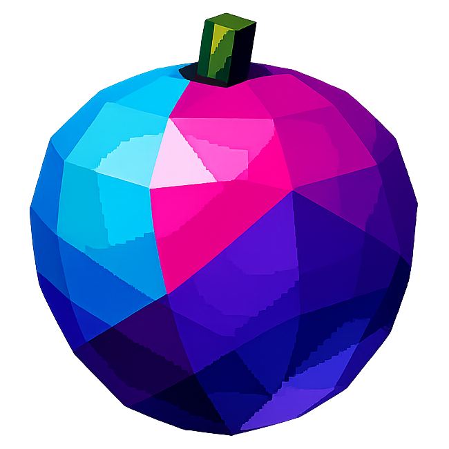

<div align="center">



# Concord Roadmap

**From foundation to ecosystem — the path to replacing Discord (and maybe Reddit too).**

</div>

---

## Vision

Concord is two things:

1. **Concord Chat** — A self-hosted Discord replacement. Real-time text, voice, video, screensharing, roles, moderation, bots. The full package.
2. **Concord Forums** — A Reddit replacement. Forum-first frontend over the same backend. Servers are communities ("grapes"), forum channels are post feeds, public by default, indexable by search engines.

Same infrastructure, same API, same auth. Two frontends into the same community data. Server admins choose what they need — chat only, forums only, or both.

### How It Fits Together

```
                        ┌──────────────────────┐
                        │     Concord API       │
                        │  (Fastify + Postgres  │
                        │   + Redis + LiveKit)  │
                        └──────────┬───────────┘
                                   │
                    ┌──────────────┼──────────────┐
                    │              │              │
             ┌──────┴──────┐ ┌────┴────┐ ┌───────┴───────┐
             │ Concord Chat│ │ Concord │ │  Bot / API    │
             │  (Discord   │ │ Forums  │ │  Consumers    │
             │  replacement│ │ (Reddit │ │               │
             │  frontend)  │ │ replace-│ │               │
             │             │ │  ment)  │ │               │
             └─────────────┘ └─────────┘ └───────────────┘
```

A **Concord server** = a community. It can have:
- **Text channels** — real-time chat (Discord-style)
- **Voice channels** — persistent hop-in/hop-out rooms (LiveKit)
- **Forum channels** — threaded posts with upvotes, comments, tags (Reddit-style)

In Chat, you see the Discord layout: server rail, channel sidebar, messages.
In Forums, you see a Reddit layout: feed of posts from your subscribed communities.

Same data. Same moderation. Same accounts. Two experiences.

---

## Release Phases

### Phase 0 — Foundation (v0.1.0) ✅

> **Goal:** Bootable monorepo with auth, database, API, real-time gateway, and chat UI.

| Feature | Status |
| --- | --- |
| Turborepo monorepo (web + api + shared) | Done |
| PostgreSQL 17 schema via Drizzle ORM | Done |
| Better Auth (session-based, Drizzle adapter) | Done |
| REST API: servers, channels, messages, invites, users | Done |
| WebSocket gateway: HELLO/IDENTIFY/READY, heartbeat, Redis pub/sub | Done |
| Snowflake ID generation (64-bit, custom epoch) | Done |
| Bitmask permission system with role checks | Done |
| React 19 + Vite 6 + Tailwind CSS v4 chat interface | Done |
| 4-panel layout: server rail, channel sidebar, messages, member list | Done |
| Responsive mobile layout with bottom navigation | Done |
| Brand assets, PWA manifest, favicons | Done |
| Login/register with password strength indicator | Done |
| Frontend wired to real API + WebSocket | Done |

---

### Phase 1 — Chat MVP (v0.2.0)

> **Goal:** A usable chat platform you'd actually want to use daily. Install it, invite friends, start talking.

| Feature | Description |
| --- | --- |
| Full message editing and deletion | Edit/delete your own messages, mods can delete others |
| Markdown rendering | GFM subset: bold, italic, code blocks, links, quotes, lists |
| File uploads | Images, attachments via MinIO/S3. Drag-and-drop, paste, preview before send |
| Threads | Reply threads branching from any message. Thread panel in sidebar |
| Typing indicators | "User is typing..." with batched display for multiple users |
| Presence tracking | Online/idle/DND/offline status with Redis TTL keys |
| Unread tracking | Per-channel unread counts, mention badges, "mark as read" |
| Invite system UI | Create/manage invite links with expiration and usage limits |
| PWA installability | Service worker, offline message cache, push notification registration |
| User profiles | Display name, avatar upload, status message, about section |
| Server settings UI | Name, icon, description, categories, channel management |
| Quick switcher | Cmd/Ctrl+K to fuzzy-search servers, channels, users |

---

### Phase 2 — Voice, Forums & Moderation (v0.3.0)

> **Goal:** Voice/video, the forum channel type, and moderation tools. This is where Concord becomes a real Discord replacement AND starts the Reddit angle.

| Feature | Description |
| --- | --- |
| **Voice channels** | LiveKit integration. Persistent hop-in/hop-out rooms. Mute/deafen. Speaker indicators |
| **Video chat** | Camera toggle in voice channels. Grid/spotlight view |
| **Screensharing** | Share screen or window. Multiple simultaneous streams |
| **Forum channels** | New channel type: threaded posts with title + markdown body, upvote/downvote, sort by hot/new/top, nested comment trees, admin-defined tags |
| **Public forum toggle** | Per-forum-channel setting. When enabled: publicly readable without login, indexable by search engines, SEO-friendly URLs (`/s/:server/:forum/:post`) |
| **Moderation tools** | Ban, kick, mute (timed), slowmode per-channel, audit log with filters |
| **Automod engine** | Rule-based: spam detection, link filtering, word filters, raid protection |
| **Push notifications** | Web Push API. Per-channel notification settings (all/mentions/none) |
| **iOS native wrapper** | WKWebView + LiveKit iOS SDK for background voice audio |
| **Activity feed** | Consolidated mentions, replies, reactions across all servers |

---

### Phase 3 — Scale, Search & Bots (v0.4.0)

> **Goal:** Performance at scale, search that actually works, and a bot ecosystem.

| Feature | Description |
| --- | --- |
| **Full-text search** | PostgreSQL tsvector with GIN indexes. Cross-server, cross-channel |
| **Search operators** | `from:user`, `in:#channel`, `has:link`, `has:image`, `before:date`, `after:date`, `mentions:@user`, `is:pinned` |
| **Search results UI** | Results in context (surrounding messages), visual filters sidebar |
| **Bot API** | REST + WebSocket API for bots. Bot accounts, tokens, permission scopes |
| **Webhook system** | Incoming webhooks for integrations (GitHub, CI/CD, RSS, etc.) |
| **Custom emoji** | Server-level emoji with role restrictions. Emoji picker integration |
| **User settings** | Notification preferences, appearance, accessibility, keybinds |
| **Performance** | Lazy member loading, virtual scrolling (React Virtuoso), connection sharding, message pagination optimization |
| **Self-hosting hardening** | Docker Compose production config, backup/restore scripts, health checks, resource monitoring |
| **Documentation** | Self-hosting guide, API reference, bot development guide, architecture docs |

---

### Phase 4 — Concord Forums Frontend (v0.5.0)

> **Goal:** Launch the standalone Reddit-replacement frontend. Same backend, forum-first experience.

| Feature | Description |
| --- | --- |
| **Forums frontend app** | New `apps/forums` in the monorepo. Reddit-style feed layout |
| **Home feed** | Aggregated posts from subscribed servers' forum channels, sorted by hot/new/top |
| **Community pages** | `/s/:server` — public landing page for a server's forum channels |
| **Post pages** | `/s/:server/:forum/:post` — full post with nested comment tree, vote counts |
| **Server discovery** | Browse and search public servers/communities. Categories, trending, new |
| **Cross-posting** | Share a post from one forum to another (with attribution) |
| **User karma/reputation** | Aggregate upvotes across posts and comments. Visible on profile |
| **Moderation queue** | Reported posts/comments queue for server moderators |
| **RSS feeds** | Per-forum-channel RSS/Atom feed for external consumption |
| **SEO optimization** | Server-side rendering for public forum pages. Open Graph meta tags, structured data |

---

### Phase 5 — Ecosystem (v1.0.0)

> **Goal:** Migration tooling, encryption, plugins. The full platform.

| Feature | Description |
| --- | --- |
| **Discord migration** | Import server structure, roles, channels from Discord export. Message history as archived threads |
| **Discord API shim** | Translation layer mapping Discord.js/Discord.py calls to Concord API |
| **E2EE for DMs** | Signal protocol or MLS. Opt-in for DMs and small groups. NOT for server channels |
| **TTL-ed messages** | Configurable per-channel: 30d, 90d, 1y, indefinite |
| **Plugin system** | Hook-based plugin API. Community plugins for proof-of-human, custom automod, integrations |
| **Knowledge base** | Wiki-lite pages per server. Markdown, versioned, role-based edit permissions |
| **Native mobile apps** | React Native or Expo. iOS wrapper from Phase 2 becomes foundation |
| **Custom themes** | Free theme customization (accent color, backgrounds). No paywall |
| **Server folders** | Group servers in the rail. Drag to reorder |

---

## Monetization Architecture

> **Model: GitLab-style open core.** Self-hosted is fully featured. Revenue from managed hosting.

### Self-Hosted (Free Forever)

- Every feature. No artificial limits. No phoning home. No license keys.
- Single `docker compose up` for the full stack.
- AGPL-3.0 with no CLA — the code can never be relicensed or rugpulled.
- Community support via GitHub Discussions.

### Managed Hosting (Concord Cloud)

A hosted tier where we run the infrastructure. Pay for convenience, not features.

**Architecture considerations:**

| Component | Approach |
| --- | --- |
| **Compute** | Railway or Fly.io. Per-instance containers with auto-scaling |
| **Database** | Managed Postgres (Neon, Supabase, or Railway Postgres) with per-tenant schema isolation |
| **Media storage** | Cloudflare R2 (S3-compatible, free egress) |
| **Voice/Video** | LiveKit Cloud or self-managed LiveKit cluster |
| **CDN** | Cloudflare for static assets and public forum pages |
| **Billing** | Stripe. Monthly per-server pricing |
| **Tenant isolation** | Schema-per-tenant in shared Postgres cluster (cost efficient) or dedicated instance for large servers |

**What managed hosting includes:**
- Automatic updates and security patches
- Daily backups with point-in-time recovery
- SSL/TLS and custom domain support
- Uptime SLA
- Priority support
- Media CDN with generous storage
- Voice/video infrastructure (LiveKit)

**What it does NOT include that self-hosted doesn't:**
- Nothing. Every feature is in both. Managed hosting is purely an operational convenience.

### Sustainability Model

| Revenue Stream | When |
| --- | --- |
| GitHub Sponsors / Open Collective | Now |
| Managed hosting (Concord Cloud) | After v0.3.0 (voice + forums) |
| Support contracts for large deployments | After v1.0.0 |
| Managed forum hosting for communities | After v0.5.0 (forums frontend) |

The AGPL license is the monetization protection. Anyone running a modified Concord as a service must share their changes. This prevents competitors from taking the code closed-source without contributing back. No CLA means even the original maintainers can't relicense — the community always has the code.

---

## Competitive Positioning

| | Concord | Discord | Matrix | Fluxer | Stoat | Zulip |
| --- | --- | --- | --- | --- | --- | --- |
| Self-hostable | Single docker compose | No | Yes (painful) | Yes (heavy) | Yes | Yes |
| FOSS | AGPL, no CLA | No | Apache 2.0 | AGPL + CLA | AGPL | Apache 2.0 |
| Voice/Video | LiveKit | Yes | Broken across clients | Yes | No (rewriting) | Jitsi (call-based) |
| Forum channels | Built-in, public toggle | No | No | Planned | No | No |
| Search | Full-text with operators | Broken | Basic | Unknown | Basic | Good |
| Mobile | PWA + iOS native | Native apps | Fragmented clients | PWA | No app | Native apps |
| Resource usage | <512MB idle target | N/A | 3-4GB (Synapse) | 8c/16GB | Unknown | ~1GB |
| Moderation | Full toolkit | Yes | Basic | Yes | Basic | Basic |
| Bot API | Discord-compatible shim | Yes | Yes | Unknown | No | Yes |
| Knowledge persistence | Forum channels + wiki | Pins only | No | Planned | No | Topics |
| Rugpull risk | Zero (AGPL, no CLA) | N/A | Low | Medium (CLA) | Low | Low |

---

## Design Principles

1. **Familiar enough to feel like home.** Match Discord's proven patterns where they work. Don't innovate on navigation — innovate on features.
2. **Information should persist.** Chat is ephemeral. Forums, wikis, and search make knowledge discoverable.
3. **Self-hosting is a first-class citizen.** Not an afterthought. Not a degraded experience. The full platform in one command.
4. **No artificial scarcity.** Every feature is available to every deployment. Monetize convenience, not capability.
5. **Moderation at scale.** Communities of 50k+ need real tools, not toys. Automod, audit logs, role hierarchies, timed actions.
6. **The license IS the protection.** AGPL + no CLA means the code stays open forever. Period.

---

<div align="center">

*This is a living document. Updated alongside development progress.*

**[Back to README](README.md)** | **[Full Specification](spec.md)** | **[Changelog](CHANGELOG.md)**

</div>
